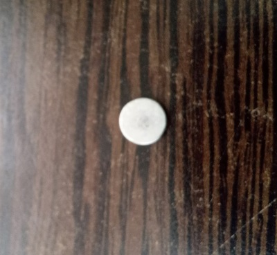
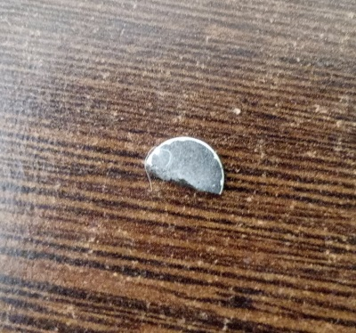
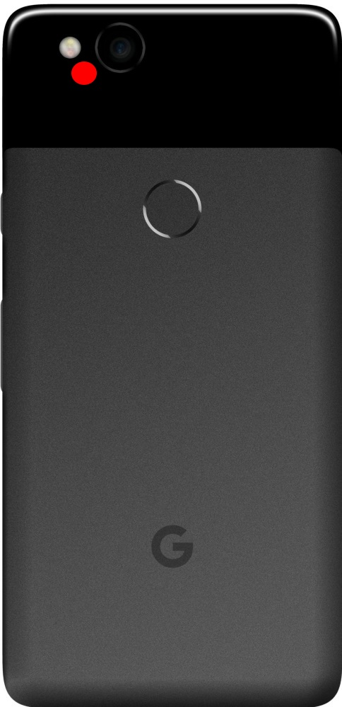
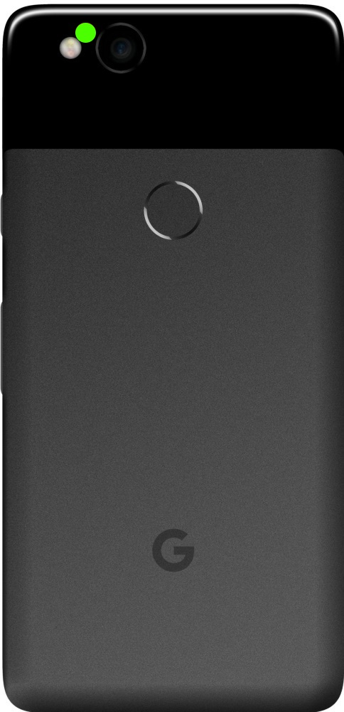
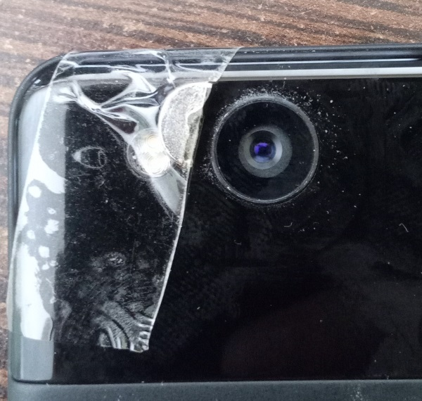
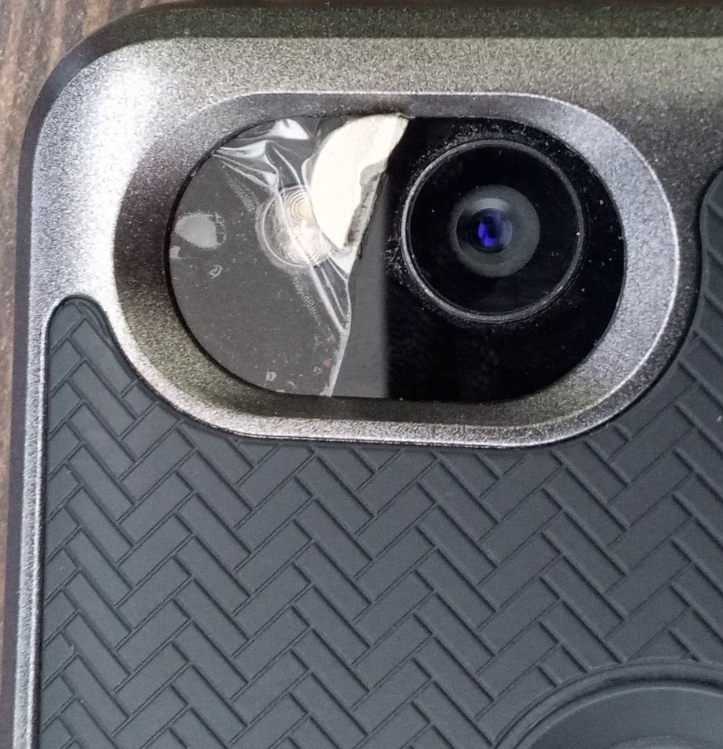
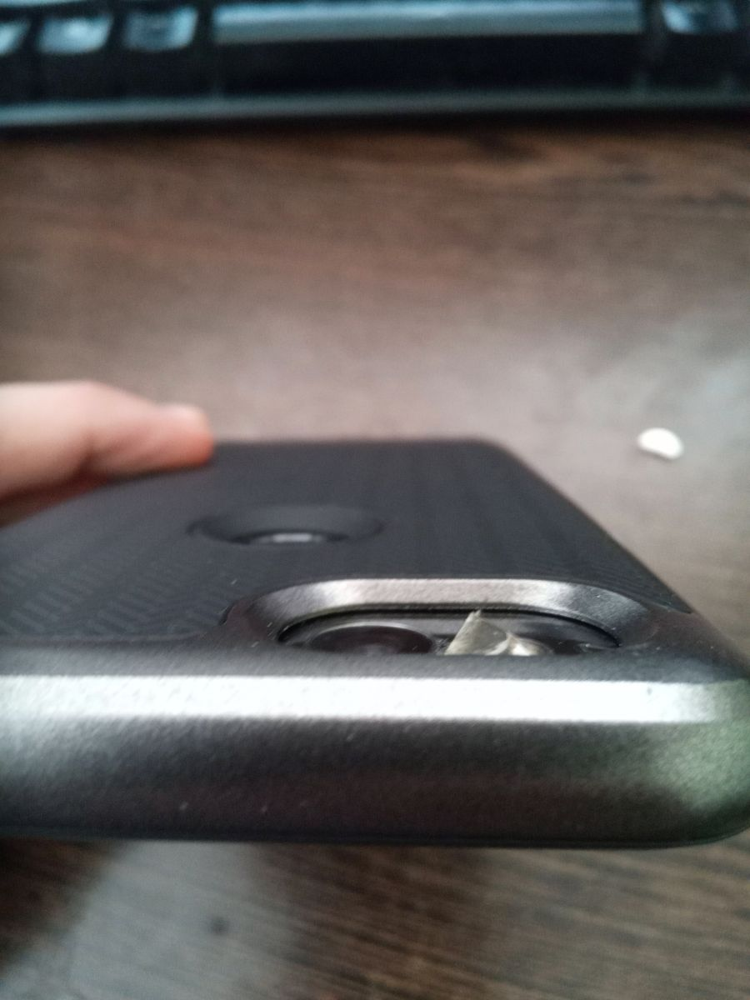

*UPDATE*
=======
The magnet trick worked for some time, but eventually i decided to replace the back camera. I bought a module from AliExpress, and now everything works. I cannot see any difference in photo quality.

Google Pixel 2 Camera "fix"
=======

If you want to skip the intro, go to the [proposed "fix"](#fix).

Since you are already reading this, you may be familiar that there is an ongoing problem with the Google Pixel 2 Camera for many users. Here are a few examples for people reporting this:
> https://support.google.com/pixelphone/thread/3317373?hl=en  
> https://support.google.com/pixelphone/thread/3734037?hl=en  
> https://support.google.com/pixelphone/thread/11266161?hl=en  
> https://support.google.com/pixelphone/thread/13316433?hl=en  
> https://www.youtube.com/watch?v=zu2TEk6MboE  

And you can read some articles about it:
> https://piunikaweb.com/2019/12/26/google-pixel-2-2-xl-camera-allegedly-crashing-after-december-update/  
> https://www.androidpolice.com/2020/01/31/pixel-2-users-facing-camera-failure-after-android-10-update/  
> https://www.androidauthority.com/google-pixel-2-camera-broken-1093499/   
> https://9to5google.com/2020/03/16/google-camera-reviews/  

And you can read a ton of negative feedback in Play Store for the Google Camera app:
> https://play.google.com/store/apps/details?id=com.google.android.GoogleCamera&showAllReviews=true

**In short, camera works only about 10% of the time, and in the other 90% it is either crashing or just not opening.** Many users are reporting that this happened after a software update. I'm also one of the victims and have been searching for a solution since. I find my Pixel 2 phone to be perfectly suitable for my needs and obviously this got me very angry. 

I tried to contact Google, and after a long conversation, the only solution they offered me is to take it to a repair shop, since my device is out of warranty. 

So, I decided to dig a bit into this issue. Firstly, I tried almost everything that included software - clear cache, data and so on, reinstalled Camera app, etc. Even did a factory reset. As you may already know, this didn't fix anything. One user in the links above even tried to revert to an older version of Android to no avail.

All of this lead me to the conclusion that this is indeed a hardware issue. I think that a software update could in fact break a faulty hardware that had some design or manufacturing issues. To be fair, I cannot know how exactly an update could break the sensor but this could well be related to overheating. The Pixel 2 camera tends to get hot when used for a prolonged time.

Then I connected to the phone via adb and got this logcat and saw:

> 03-06 10:10:17.858 15152 19640 E mm-camera: <SENSOR><ERROR> 321: af_actuator_move_focus: failed rc: -1  
> 03-06 10:10:17.858 15152 19640 E mm-camera: <SENSOR><ERROR> 1110: actuator_process: failed rc -1  
> 03-06 10:10:17.858 15152 19640 E mm-camera: <SENSOR><ERROR> 1515: port_sensor_handle_upstream_module_event: failed  

A storm of these errors occur when I try to open the camera. I seems that there is a problem with the focus sensor.

After I tried to mingle everything that was software related, I decided it was time to play physically with the phone. I tried to tap (or rather bang) it from the side while loading the camera, in an attempt to "help" the focus sensor. It didn't work. Then I tried to approach a magnet. And...I was very surprised that it made a difference.

___

So. A magnet.

I started to experiment with the magnet. A got a few round small neodymium magnets, that are rather strong for their small size and started to place it near the camera ot the back of the phone.

Then I broke one of the magnets in half, so that it could fit better:

I was using a scotch tape to fix the magnet on a specific location. I saw that if it is close enough to the lense, the Camera App would start every time!

But, there were some problems. If the magnet was near this location:

The image will always be out of focus.

Or if the magnet is too close to the lense, the image would be distorted.

After an hour or so of playing I found a sweet spot, that would make the camera app work and image would be crisp.

**Bare in mind that it was a touch and go, even half a millimeter would change the outcome!**

In my case, there were three possible outcomes: 
* The image was distorted or out of focus - the magnet is too close to the lense or near the red dot on the image above.
* The Camera app crashes - the magnet is too far away
* Everything works - sweetspot!

**After that, I fired up logcat again, and voalá: no trace of the previous error!**

I know this is maybe not the solution you were expecting, and definitely it is not high tech! I'm not even sure this will work for everyone or how long will it last. I have been using it for like a week and the camera is working just fine.

The magnet is so small that it is not even sticking out at all of the phone case I'm using.

Next step is to stick it with double sided tape or if you are brave enough, with a super-glue :)

Try it out for yourself and good luck.
